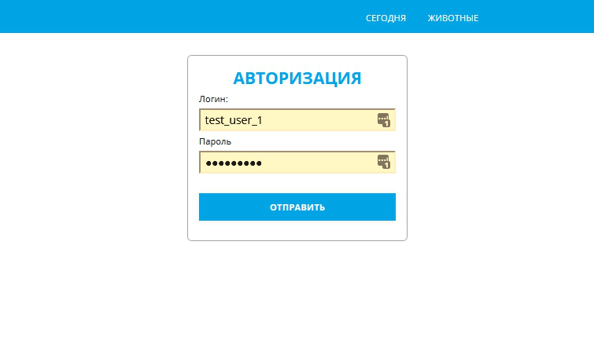
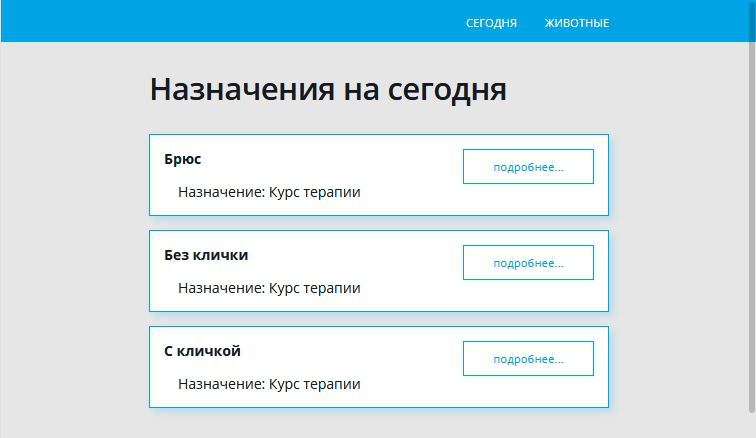
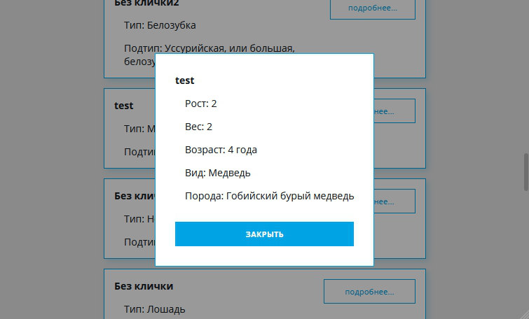

# Тестовая работа для Acits - приюта для животных

Задача: создать приложение на `React/Redux` для подключения к тестовому серверу по предоставленному API. Необходимо получить, обработать и в удобной форме вывести данные (инфорацию о животных и назначенных процедурах) пользователю

## Подробнее о задании

Приложение должно предлагать пользователю авторизацию и в случае успеха открывать доступ к двум закрытым разделам:
1. назначения на сегодня,
2. общий список животных в приюте.

Для авторизации необходимо ввести правильные логин и пароль.
На обеих закрытых страницах данные выводятся в виде списка.

При клике на карточку питомца должно появляться окно с подробной информацией.

Временная ссылка на работающую версию программы: [http://frontenddeveloper.ru/acits](http://frontenddeveloper.ru/acits).

## Реализация

Проект создан на Create React App.
Использовались библиотеки:
1. redux для хранения данных
2. react-redux для использования connect в контейнерных компонентах
3. axios как замена fetch для упрощения отправки запросов
4. sass как препроцессор для css

## Структура проекта

`api/api.js` - Этот модуль осуществляет запросы на сервер через axios и возвращает необходимые данные в компоненту\
`components` - Здесь лежат все компоненты программы. В ряде случаев использовал контейнеры с функцией **connect(mapStateToProps, mapDispatchToProps)**. Стили в scss подключены в виде модулей, лежат в одних папках со своими компонентами.\
`components/_shared` - папка для общих компонент, которые могут переиспользоваться в разных частях проекта.\
`fonts` - шрифты.\
`helpers` - функции помощники, вынесенные из компонент для их реиспользования: перевод даты в возраст, поиск заданных атрибутов в характеристиках животного и склонение слова "год".\
`redux` - здесь находится store.js и редюсеры.
`scss` - папка с общими стилями, миксинами, переменными.

## Скриншоты

**Окно авторизации**

​

**Страница "Сегодня"**

​

**Страница "Животные" и модальное окно**

​
